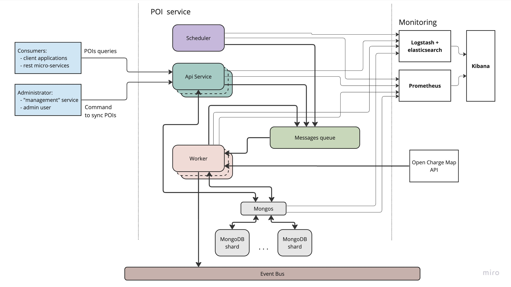

# High-level architectural diagram

## POI import service parts

### Api service

*Api service* offers a lightweight and stateless solution, providing interfaces for querying point of interest (POI) data using graphQL. It also enables the initiation of new commands to import and synchronize POI data for new regions. Its simplicity and lack of state dependence make it easily scalable horizontally, capable of handling a high volume of requests with ease.

### Scheduler

The scheduler service is designed to be deployed as a singular instance and is responsible for periodically triggering commands to import and synchronize point of interest (POI) data based configuration. 
Possible configuration implementation:
- environment variable
- configuration in database & admin interface to manage it

### Worker

The Worker service is the key part of importing POI data. The service has the capability to generate multiple subtasks as part of the import process, and subsequently enqueueing them for processing. The asynchronous execution of tasks in the background ensures seamless performance without interrupting other processes.

In the case of an error, the task handler incorporates a retry strategy, guaranteeing robustness and minimal disruption to operations. This proves particularly valuable in maintaining data integrity and ensuring a consistent user experience.

Furthermore, the scalability of the Worker service is a key asset, as it allows for the deployment of multiple instances to boost productivity. This flexibility enables the system to adapt to varying workloads and accommodate growing demands without sacrificing performance.

### Messages queue

The data import tasks are managed and executed using a message queue, leveraging the efficient and reliable [Redis](https://redis.io/) database and [BullMQ](https://docs.bullmq.io/) library. This architecture ensures optimal performance and seamless processing of import tasks.

> [!NOTE]
> Another messages queue can be used based on current tech stack used in the project.

> [!TIP]
> // TODO: describe the idea that dynamic queues can be used to handle the moment when "certain import" process if finished

### MongoDB

// TODO: add database overall description and why mongo db is best choice here

## Event bus

The event bus is main broadcaster to notify within the application, specifically regarding the creation or update of POIs. This ensures seamless communication and synchronization across different parts of the application.

## Monitoring

Every part of the **POI import service** logs internal processes, including incoming requests, task execution start and end times, as well as any encountered errors. These logs are channeled through logstash, preserved, indexed, and effortlessly retrievable via elasticsearch in Kibana. This streamlined process ensures transparent and accountable monitoring and troubleshooting of system activities.

Furthermore, each service component must provide a health-check to ascertain the service's operational status. This feature is essential for ensuring the reliability and efficiency of the import service by enabling proactive monitoring of its overall health and wellbeing.
In addition to the basic availability of the service itself, health-check must check for the availability of the resources used, such as the database, messages queue, etc.
​
Kibana allows to configure alerts based on logs and statistics from Prometheus. This empowers proactive monitoring and swift response to critical events, further enhancing the reliability and stability of the import service.

## [Open Charge Map](https://openchargemap.org/site) and it's [API](https://openchargemap.org/site/develop/api)
