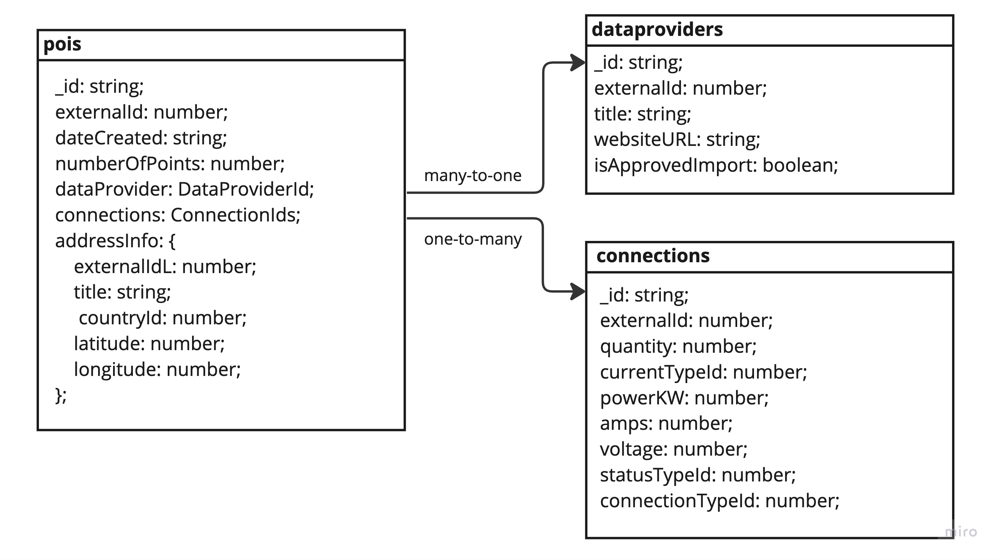

# Mongo database structure and schema



> [!NOTE]
> Current database schema is simplified as it's challenge. [OpenChargeMap API](https://openchargemap.org/site/develop/api) provides a lot of data but only certain data is selected to demonstrate different relationships in the data structure

### Relations

- One-to-one: **POI** <-> **AddressInfo**.
- Many-to-one: **POI** -> **DataManager**.
- One-to-many: **POI** -> **Connection**.

> [!NOTE]
> **AddressInfo** isn't presented as a separate collection as
> 1) as it speeds up **POI** queries (denormalization)
> 2) **POI** sharding based on AddressInfo values

### Indexes

* **POI** collection has indexes: `externalId`, `AddressInfo.externalId`, `AddressInfo.countryId`
* **DataManager** collection has indexes: `externalId`
* **Connection** collection has indexes: `externalId`, `quantity`, `currentTypeId`, `powerKW`, `amps`, `voltage`, `statusTypeId`, `connectionTypeId`

> [!NOTE]
> The current count of indexes is quite small. It's worth to add new indexes for properties that participate in query as filter value

### Sharding

* **POI** collection sharing is based on `AddressInfo.latitude` and `AddressInfo.longitude` as these values present geospatial data
* **DataManager** & **Connection** collections sharding are based on `externalId` as current data set doesn't have more suitable properties

### Improvements

> [!TIP]
> There is an idea to add collection for **Imports**. In the future, there is a possibility to query the status of the import processes and receive notifications when the import is completed or an error has occurred. Based on this collection, there is a possibility to build dynamic messages queues

```
{
  commandId: String;
  status: Enum('pending', 'completed', 'failed');
  importedCount: Number;
  startedAt: Date;
  completedAt: Date;
}
```
